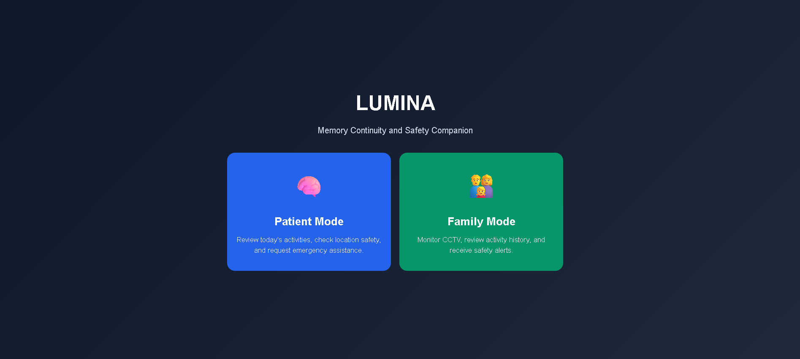
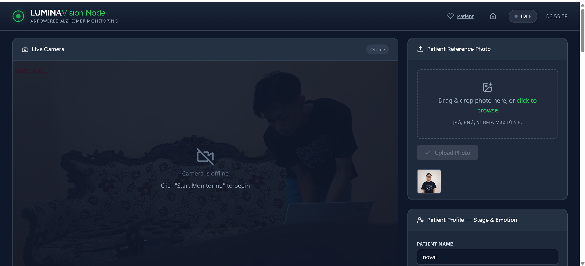
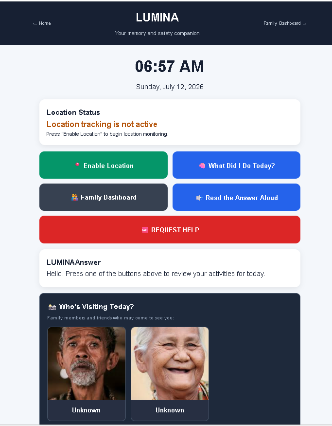

# 🧠 LUMINA — AI-Powered Alzheimer Patient Monitoring System

<!-- Banner image (replace with real project cover) -->



> **AMD ACT-II Hackathon Submission**  
> Computer Vision + AI for real-time Alzheimer patient safety monitoring

[](https://www.python.org/)
[](https://fastapi.tiangolo.com/)
[](https://opencv.org/)
[](https://www.docker.com/)
[](LICENSE)

---

## 📖 Overview

**LUMINA** is an intelligent monitoring system designed to ensure the safety and well‑being of Alzheimer patients. It combines **computer vision**, **face recognition**, **GPS geofencing**, and **emotion detection** to provide real‑time alerts and peace of mind for families and caregivers.

## Problem Statement

Alzheimer’s disease affects millions worldwide, and patients often wander or become confused, putting them at risk of injury or getting lost. Existing solutions are either costly, require complex hardware, or lack real‑time monitoring capabilities. **LUMINA** addresses this gap by offering an affordable, AI‑driven system that monitors patients via CCTV, detects unsafe situations, and notifies caregivers instantly.

## AMD Infrastructure

### Why AMD infrastructure matters

LUMINA processes video streams and runs deep‑learning models for face detection, emotion analysis, and object tracking. AMD GPUs, combined with the ROCm software stack, provide the low‑latency, high‑throughput inference needed for real‑time monitoring on edge devices while keeping hardware costs affordable.

### Design for AMD deployment

The backend isolates vision‑related logic behind a **provider interface**. The default provider can be swapped for an AMD‑optimized implementation that uses the ROCm‑enabled PyTorch libraries. No other part of the application needs to change – the provider is instantiated based on configuration at start‑up.

### Configurable environment variables

- **AMD_VISION_URL** – URL of the AMD‑hosted inference service (e.g., a REST endpoint exposing the model).
- **AMD_MODEL_NAME** – Identifier of the specific vision model to load on the AMD service.
  These variables are read at runtime and passed to the provider, allowing the same codebase to point at different inference back‑ends without code changes.

### Provider‑based architecture

LUMINA employs a **provider‑based architecture** for vision inference. The application core calls a generic `VisionProvider` interface; concrete implementations (AMD, OpenAI, local ONNX, etc.) fulfil this contract. This design enables easy replacement of the inference backend while keeping the business logic untouched.

### Development with an alternative endpoint

During development we often lack continuous access to AMD GPU resources. Therefore the default configuration points at a compatible, cloud‑based inference endpoint that mimics the AMD API. Switching to an actual AMD‑hosted service simply requires updating the two environment variables.

### Simple deployment configuration

Deploying on AMD hardware does **not** require code modifications. Provision an AMD GPU node, set `AMD_VISION_URL` and `AMD_MODEL_NAME` in the `.env` file (or container environment), and the application will automatically use the AMD provider.

#### Future Deployment

The project is fully deployment‑ready for AMD infrastructure. Once AMD GPU resources become available, connecting the application to an AMD‑hosted inference endpoint is a matter of updating the environment variables – no further code changes are needed.

### 🎯 Key Features

| Feature                  | Description                                                                        |
| ------------------------ | ---------------------------------------------------------------------------------- |
| 🔍 **Patient Detection** | Real-time clothing color fingerprint + face recognition tracking via CCTV          |
| 📍 **GPS Safe Zone**     | Geofencing with Haversine distance — alerts when patient leaves home radius        |
| 🆘 **SOS Button**        | One-tap emergency alert with last known GPS location                               |
| 📸 **Memory Gallery**    | Family uploads photos with names/relationships to help patient remember loved ones |
| 😊 **Emotion Agent**     | Auto-detects patient emotional state from activity patterns                        |
| 📊 **Activity Timeline** | Chronological log of all detections, alerts, and events                            |
| 🎥 **Live CCTV Stream**  | MJPEG stream with annotated bounding boxes                                         |

---

## 🏗️ Architecture

<!-- Architecture diagram (replace with real diagram image) -->


```
┌──────────────────────────────────────────────────────┐
│                    LUMINA System                      │
├───────────────┬──────────────┬───────────────────────┤
│  Family       │  Patient     │  Backend (FastAPI)     │
│  Dashboard    │  Dashboard   │  ├─ CCTV Engine        │
│  (Web UI)     │  (Mobile)    │  ├─ Face Recognition   │
│               │              │  ├─ GPS Geofencing     │
│               │              │  ├─ Emotion Agent      │
│               │              │  └─ SQLite Database    │
└───────────────┴──────────────┴───────────────────────┘
```

### Tech Stack

- **Backend:** FastAPI (Python 3.11), Uvicorn
- **Computer Vision:** OpenCV, face-recognition (dlib), NumPy
- **Database:** SQLite
- **Frontend:** Vanilla HTML/CSS/JS (served by FastAPI)
- **Deployment:** Docker + Docker Compose

---

## 🚀 Quick Start (Docker)

### Prerequisites

- [Docker](https://docs.docker.com/get-docker/) & Docker Compose
- Git

### 1. Clone the repository

```bash
git clone https://github.com/novaldarma/LUMINA.git
cd LUMINA
```

### 2. Set up environment variables

```bash
cp .env.example .env
# Edit .env with your configuration (optional — works out of the box)
```

### 3. Build & Run with Docker Compose

```bash
docker-compose up --build
```

The application will be available at: **http://localhost:8000**

### 4. Access the Dashboards

| Dashboard          | URL                                          |
| ------------------ | -------------------------------------------- |
| Family Dashboard   | http://localhost:8000/family_dashboard.html  |
| Patient Dashboard  | http://localhost:8000/patient_dashboard.html |
| API Docs (Swagger) | http://localhost:8000/docs                   |

---

## 🖥️ Local Development (Without Docker)

```bash
# Create virtual environment
python -m venv venv
venv\Scripts\activate  # Windows
# source venv/bin/activate  # macOS/Linux

# Install dependencies
pip install -r requirements.txt

# Run the server
uvicorn backend.main:app --host 0.0.0.0 --port 8000 --reload
```

---

## 📡 API Endpoints

| Method | Endpoint                | Description                    |
| ------ | ----------------------- | ------------------------------ |
| `GET`  | `/api/health`           | Health check                   |
| `GET`  | `/api/status`           | Monitoring status              |
| `POST` | `/api/start-monitoring` | Start CCTV monitoring          |
| `POST` | `/api/stop-monitoring`  | Stop CCTV monitoring           |
| `GET`  | `/api/camera-stream`    | Live MJPEG stream              |
| `GET`  | `/api/logs`             | Activity logs                  |
| `POST` | `/api/upload-reference` | Upload patient reference photo |
| `PUT`  | `/api/safe-zone`        | Configure GPS safe zone        |
| `POST` | `/api/location`         | Update patient GPS location    |
| `POST` | `/api/sos`              | Trigger SOS emergency          |
| `POST` | `/api/memories`         | Upload memory photo            |
| `GET`  | `/api/memories`         | List memory photos             |
| `GET`  | `/api/patient-config`   | Get patient profile            |
| `PUT`  | `/api/patient-config`   | Update patient profile         |

Full API documentation: http://localhost:8000/docs

---

## 🐳 Docker Deployment

```bash
# Build the image
docker build -t lumina-api .

# Run the container
docker run -p 8000:8000 \
  -v $(pwd)/lumina_core.db:/app/lumina_core.db \
  -v $(pwd)/uploads:/app/uploads \
  lumina-api
```

Or use Docker Compose for easier volume management:

```bash
docker-compose up -d
```

---

## 📁 Project Structure

```
LUMINA/
├── backend/
│   ├── main.py              # FastAPI application
│   ├── database.py          # SQLite database layer
│   ├── cctv_engine.py       # OpenCV monitoring engine
│   └── patient_photos/      # Reference photos (gitignored)
├── frontend/
│   ├── family_dashboard.html # Family monitoring UI
│   ├── patient_dashboard.html # Patient mobile UI
│   ├── app.js               # Frontend logic
│   └── style.css            # Styling
├── uploads/
│   ├── snapshots/           # CCTV snapshots
│   └── memories/            # Memory gallery photos
├── Dockerfile
├── docker-compose.yml
├── requirements.txt
└── README.md
```

---

## 🔒 Privacy & Security

- All patient photos and data are stored **locally** — no cloud uploads
- `.env` and database files are excluded from Git
- Face encodings are stored as encrypted pickle files
- GPS data is only shared between patient device and family dashboard

---

## 🎬 Demo

<!-- Dashboard screenshots (replace with actual screenshots) -->




- **Live URL:** `http://localhost:8000` (local deployment)
  **Video Demo:** <YOUTUBE_LINK>
  **Slide Deck:** <GOOGLE_SLIDES_LINK>

---

## 👥 Team

| Name                           | Role                         |
| ------------------------------ | ---------------------------- |
| Muhamad Noval Darmawan         | Backend, Computer Vision, AI |
| Sahra Raditiya Fadillah        | Frontend, UI/UX              |
| Syeftyan Eka Fauzia Rosyidin   | Data Engineering             |
| Fauzia Nisrina Salsabila       | Project Management           |
| Jovelio Curtis Ibrani Manurung | Documentation & Presentation |

---

## 📄 License

MIT License — see [LICENSE](LICENSE) file for details.

---

<p align="center">
  <b>Built with ❤️ for AMD ACT-II Hackathon</b><br>
  <i>Making Alzheimer care smarter, one pixel at a time.</i>
</p>
